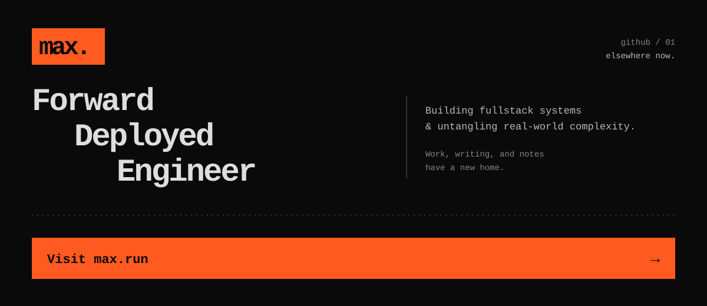

  My work, writing, and notes have moved to <a href="https://max.run"><strong>max.run</strong></a>.

<!-- max-run-content:start -->
## From max.run

_Updated nightly through the max.run MCP server._

### Pinned

- **Pinned blog** · [How I manage my dotfiles](https://max.run/blog/how-i-manage-my-dotfiles)
- **Pinned blog** · [Ambient request context in Node.js](https://max.run/blog/ambient-request-context)
- **Pinned note** · [Inline Python dependencies with PEP 723](https://max.run/notes/inline-python-dependencies)
- **Pinned note** · [Awesome tools](https://max.run/notes/hidden-tools)

### New or updated in the last 7 days

- **Updated blog** · [A field guide to this blog](https://max.run/blog/hello-world)
- **Updated note** · [Awesome tools](https://max.run/notes/hidden-tools)
- **New note** · [Use DNS to publish a version pointer for a private repo](https://max.run/notes/dns-version-pointer-private-repo)
<!-- max-run-content:end -->
